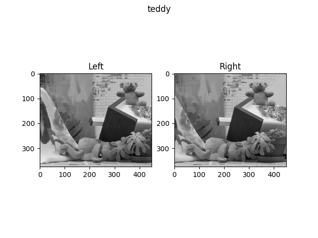
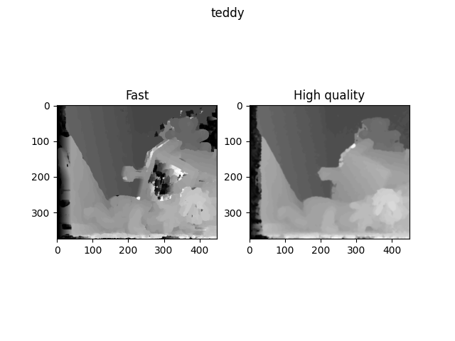

# Semi-Global Matching Stereo Disparity
Implemented with numpy for ROB501 at the University of Toronto.

A somewhat efficient implementation of a basic sum of squared differences algorithm and a high quality SGM function.

This algorithm uses the census transform (with hamming distance as the similarity metric) with an
8 direction semi-global matching algorithm. The 4 direction version fails on the mars test images.

We also post processes with a median and bilateral filter to try to remove noise and smooth the disparity map.
We use the original image as the guidance image for the bilateral filter because we assume the heuristic that changes in depth
correspond with changes in intensity.

Examples:
| Input | Output |
| --- | --- |
|  |  |
|  |  |
|  |  |
|  |  |
|  |  |
